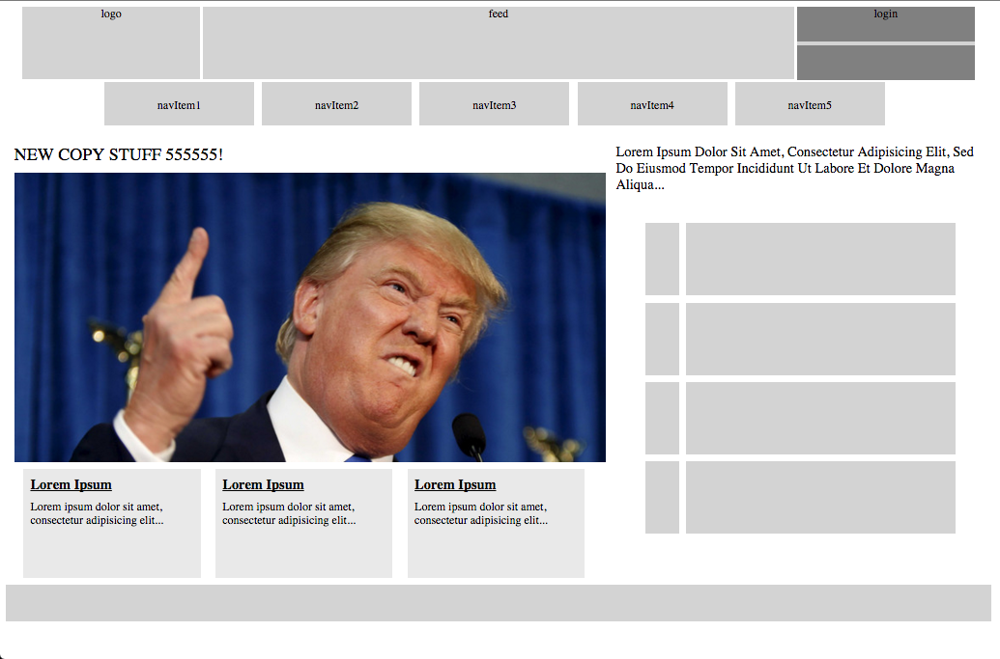

# news_aggregator

News Aggregator

When clicking any of the top nav links it will use the associated constructed component to push new text into the headline above Trumps hairpiece.

Below is the wireframe I'm working from:

